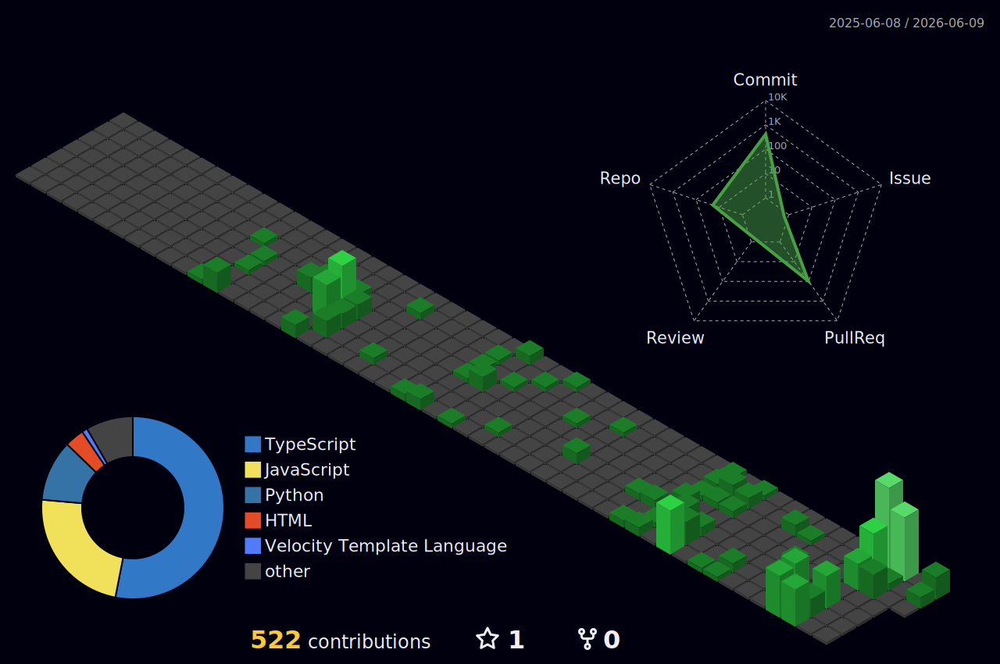

<div align="center">


<br/>

[](https://github.com/ShabalalaWATP)
[](https://github.com/ShabalalaWATP)
[](https://www.lancaster.ac.uk/)

</div>


### `$ cat about_me.txt`

```yaml
name: Alex Orr
location: Gloucestershire, UK
role: Cyber Security Professional
education:
  current: MSc Cyber Security — Lancaster University
background:
  - 10+ years in technical roles across the public sector
  - Passionate about security research & building tools
  - Led engineering teams solving hard problems
  - Competed in ML hackathons, broke things, fixed things
interests:
  - Cyber | AI | Software | Geopolitics
```


### `$ cat /proc/currently_working_on`

<div align="center">
<table>
<tr>
<td align="center" width="25%">
<br/>
<sub><b>Lancaster University</b></sub><br/>
<sub>Risk Management & Threat Intelligence</sub>
</td>
<td align="center" width="25%">
<br/>
<sub><b>Code Deobfuscation</b></sub><br/>
<sub>Multi-pass analysis workbench</sub>
</td>
<td align="center" width="25%">
<br/>
<sub><b>AI-Assisted Vuln Research</b></sub><br/>
<sub>React / Python / Exploit Dev</sub>
</td>
<td align="center" width="25%">
<br/>
<sub><b>LLM Harnesses & ML</b></sub><br/>
<sub>n8n / Codex / Custom Agents</sub>
</td>
</tr>
</table>
</div>


### `$ cat /etc/interests.conf`

<table>
<tr>
<td width="50%" valign="top">

#### Cyber & Security
- Vulnerability Research & Reverse Engineering
- Application Security & OWASP
- OSINT & Intelligence Analysis
- Offensive Security Tooling
- Threat Modelling & Attack Trees

</td>
<td width="50%" valign="top">

#### AI / ML & Software
- Building agentic harnesses around LLMs
- Machine Learning model development
- Natural Language Processing
- Web scraping & data pipelines
- Full-stack web development

</td>
</tr>
</table>

> *I also keep a close eye on the chessboard of global affairs — geopolitics, conflict dynamics, OSINT, and the intersection of technology and statecraft. If it shapes the threat landscape, I'm reading about it.*


### `$ ls ~/toolkit/`

<div align="center">


</div>


### `$ find ~/projects -type f -name "*.cool" | head`

<div align="center">

<a href="https://github.com/ShabalalaWATP/Unweaver"></a>
<a href="https://github.com/ShabalalaWATP/VRAgent"></a>
<a href="https://github.com/ShabalalaWATP/PowerShellAI"></a>
<a href="https://github.com/ShabalalaWATP/UkraineOSINT"></a>
<a href="https://github.com/ShabalalaWATP/AttackTree"></a>
<a href="https://github.com/ShabalalaWATP/GARDIAN"></a>
<a href="https://github.com/ShabalalaWATP/ai-assisted-osint-tool"></a>
<a href="https://github.com/ShabalalaWATP/SafePassage"></a>

</div>


### `$ uptime --career`

```
 10+ years solving problems in the public sector
 ├── Led technical teams of up to 20 people
 ├── Built tooling, broke software, wrote reports nobody read
 ├── 2nd place — AWS DeepRacer ML Hackathon (out of 50 teams)
 └── Currently: MSc Cyber Security @ Lancaster University (2026-27)
```


<div align="center">

### `$ cat /var/log/contributions.log`

<br/>


<br/>


<br/><br/>

<picture>
  <source media="(prefers-color-scheme: dark)" srcset="./profile-3d-contrib/profile-night-green.svg" />
  
</picture>

<br/><br/>


<br/><br/>


<br/><br/>


<br/><br/>


</div>
